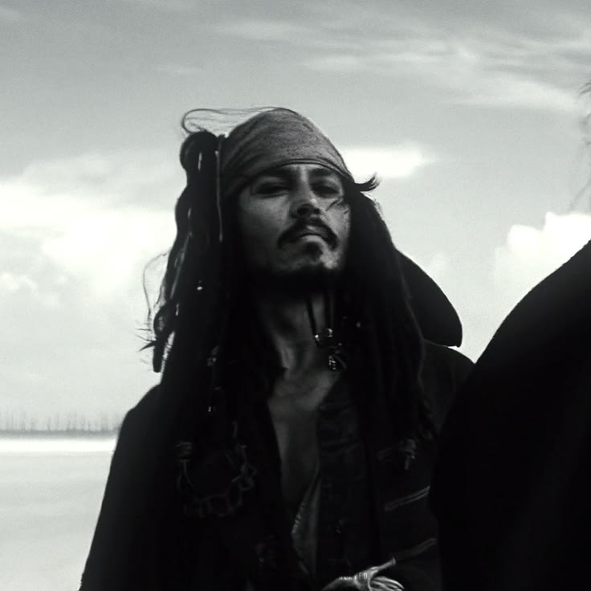

<html lang="fa" dir="rtl">
<head>
  <meta charset="UTF-8" />
  <meta name="viewport" content="width=device-width, initial-scale=1.0" />
  <title>subkazani.ir</title>
  <link rel="preconnect" href="https://fonts.googleapis.com" />
  <link href="https://fonts.googleapis.com/css2?family=Vazirmatn:wght@300;400;500;600&display=swap" rel="stylesheet" />
  
</head>
<body>
  <audio id="morseAudio" src="Music.mp3" preload="auto"></audio>
  <audio id="aktorAudio" src="aktor.mp3" preload="auto"></audio>
  <audio id="totoAudio" src="toto.mp3" preload="auto"></audio>

  <header class="header">
    

      

      

        <!-- عکس خودت رو با اسم avatar.jpg کنار این فایل بذار -->
        

        

        

        

        

        

        

        

        

        

        

        

        

        

        

        

        

      

    

  </header>

  <main class="content">
    
شاید در زندگی بعدی

    
maybe in the next life

    

    
گاهی یک جنگ برای ماندن محترم از یک صلح است برای رفتن

    
Sometimes a war fought to stay is more honorable than a peace made to leave.

    <!-- Morse Code with Circular Text -->
    

      

        <svg class="morse-text-svg" viewBox="0 0 240 240">
          <defs>
            <path id="circle" d="M 120, 120 m -105, 0 a 105,105 0 1,1 210,0 a 105,105 0 1,1 -210,0" fill="none" />
          </defs>
          <text font-size="11" font-weight="700" fill="rgba(255,255,255,0.75)" letter-spacing="1">
            <textPath href="#circle" startOffset="0%" text-anchor="start">
              🎵 PLAY ME &nbsp;•&nbsp; اضغط علي &nbsp;•&nbsp; 我来播放 &nbsp;•&nbsp; क्लिक करे &nbsp;•&nbsp; クリック &nbsp;•&nbsp; Klik Mig &nbsp;•&nbsp; 🎵 PLAY ME
            </textPath>
          </text>
        </svg>
        

          
:(

        

      

    

    

    
فهمیدم دل خوش نکنم به این رویش به قول ونگوگ، غم همیشه باقیه

    
I realized I shouldn't get my hopes up over this blooming: As Van Gogh said, "The sadness will last forever."

    

      

        <svg class="morse-text-svg" viewBox="0 0 240 240">
          <defs>
            <path id="circle2" d="M 120, 120 m -105, 0 a 105,105 0 1,1 210,0 a 105,105 0 1,1 -210,0" fill="none" />
          </defs>
          <text font-size="11" font-weight="700" fill="rgba(255,255,255,0.75)" letter-spacing="1">
            <textPath href="#circle2" startOffset="0%" text-anchor="start">
              🎵 PLAY ME &nbsp;•&nbsp; اضغط علي &nbsp;•&nbsp; 我来播放 &nbsp;•&nbsp; क्लिक करे &nbsp;•&nbsp; クリック &nbsp;•&nbsp; Klik Mig &nbsp;•&nbsp; 🎵 PLAY ME
            </textPath>
          </text>
        </svg>
        

          
:(

        

      

    

    

    
ـ حالا بزار روحِ من دور بشه اَزَت ـ

    

      

        <svg class="morse-text-svg" viewBox="0 0 240 240">
          <defs>
            <path id="circle3" d="M 120, 120 m -105, 0 a 105,105 0 1,1 210,0 a 105,105 0 1,1 -210,0" fill="none" />
          </defs>
          <text font-size="11" font-weight="700" fill="rgba(255,255,255,0.75)" letter-spacing="1">
            <textPath href="#circle3" startOffset="0%" text-anchor="start">
              🎵 PLAY ME &nbsp;•&nbsp; اضغط علي &nbsp;•&nbsp; 我来播放 &nbsp;•&nbsp; क्लिक करे &nbsp;•&nbsp; クリック &nbsp;•&nbsp; Klik Mig &nbsp;•&nbsp; 🎵 PLAY ME
            </textPath>
          </text>
        </svg>
        

          
:(

        

      

    

  </main>

  

    <footer class="footer" id="siteFooter">Perhaps the memory of you will never fade from my mind.</footer>
  

  
🎵 در حال پخش...

  
</body>
</html>
